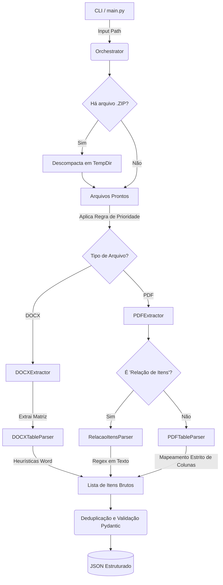

# 📄 Extrator de Dados de Licitações (PDF/DOCX)

Um serviço de Extração e Transformação de Dados (ETL) projetado para ler documentos semiestruturados de licitações públicas (Editais, Termos de Referência, Relação de Itens) e convertê-los em dados estruturados no formato JSON.

Desenvolvido como uma ferramenta CLI (Command Line Interface), este projeto está pronto para ser integrado em pipelines de dados modernos.


## 🎯 Descrição Geral do Projeto

O objetivo principal desta ferramenta é automatizar a extração da lista de produtos e serviços exigidos em processos licitatórios. Documentos governamentais possuem alta variabilidade de formatação, combinando tabelas mescladas, textos corridos e sujeiras sistêmicas (rodapés, datas, assinaturas).

Para resolver isso, o sistema atua como um orquestrador inteligente que:

1. Varre as pastas e aplica regras para identificar os melhores anexos para leitura.
2. Detecta e extrai nativamente arquivos compactados (`.zip`) em diretórios temporários na memória.
3. Aciona os motores especialistas de extração com base no tipo de arquivo e padrão detectado.
4. Devolve um payload estruturado, limpo e validado.


### 🛠️ Stack Tecnológico e Pré-requisitos

| Componente | Tecnologia | Propósito |
| --- | --- | --- |
| **Linguagem** | Python 3.11+ | Base do sistema |
| **Leitura PDF** | `pdfplumber` | Extração de texto e tabelas em PDF |
| **Leitura DOCX** | `python-docx` | Navegação em XML e tabelas mescladas em DOCX |
| **Validação** | `pydantic` | Tipagem forte e Schema de Saída |
| **Limpeza** | `unidecode` & `re` | Normalização de strings e RegEx |
| **Manipulação** | `zipfile` & `tempfile` | Descompactação segura sem sujar o disco local |

---


## ⚙️ Abordagem Técnica Adotada

A arquitetura do projeto foi estruturada com foco em **modularidade, manutenibilidade e boas práticas de engenharia de software**. O design prioriza a separação clara de componentes, garantindo que o código seja fácil de testar, escalar e manter:

1. **Orquestração Inteligente:** O sistema não lê arquivos cegamente. Ele mapeia os metadados e aplica um **Sistema de Prioridade**, buscando sempre o documento mais estruturado primeiro (*Relação de Itens > Termo de Referência > Edital*), economizando processamento.

2. **Separação de Responsabilidades (SRP):**
* Os **Extractors** atuam apenas na camada de I/O. Eles leem o arquivo físico e o transformam em uma matriz bruta.

* Os **Parsers** são os "cérebros". Eles não sabem o que é um arquivo, operam puramente aplicando regras de negócio e heurísticas sobre as matrizes.

3. **Especialização de Motores de Parsing:** 
* O parser de PDF trabalha mapeando colunas para evitar leitura de anexos falsos.

* O parser de DOCX possui heurísticas independentes para lidar com especificidades do Microsoft Word.

4. **Resiliência e Tolerância a Falhas:** O sistema foi desenhado para ser "fail-safe". Falhas críticas em um arquivo específico (como um PDF corrompido) não interrompem o pipeline. O erro é isolado, registrado no log, e o orquestrador prossegue automaticamente para o próximo edital arquivo ou licitação.

---


## 📂 Mapa da Estrutura de Diretórios

A estrutura de diretórios foi construída priorizando a divisão lógica de responsabilidades, conforme o mapa:

```text
PDF-STRUCTURE-MINER/
├── src/                        # Código-fonte principal da aplicação
│   ├── core/                   # Constantes e configurações fundamentais
│   ├── extractors/             # Camada de entrada (extração bruta de PDF/DOCX)
│   ├── parsers/                # Motores de interpretação e lógica de dados
│   ├── schemas/                # Definições de modelos (Pydantic/Validação)
│   ├── services/               # Orquestração de tarefas e fluxo de execução
│   ├── utils/                  # Ferramentas auxiliares e limpeza de dados
│   └── __init__.py             # Identificador de pacote Python
├── .gitattributes              # Atributos específicos para o repositório Git
├── .gitignore                  # Definição de arquivos ignorados pelo controle de versão
├── .python-version             # Registro da versão estável do Python do projeto
├── Dockerfile                  # Configuração para empacotamento em container
├── LICENSE                     # Documento de licença do software
├── main.py                     # Ponto de entrada (CLI) para execução do sistema
├── pyproject.toml              # Definições de build e metadados do projeto
├── README.md                   # Documentação principal para o usuário
├── requirements.txt            # Listagem de dependências para instalação via pip
└── uv.lock                     # Arquivo de trava de dependências do gerenciador uv

```

---


## 🔄 Fluxo de Execução

O projeto segue um fluxo lógico de verificação e processamento dos anexos, conforme suas extensões e estruturas, conforme o fluxo: 



---


## 📁 Estrutura de Entrada Esperada

Para o processamento em lote, a CLI é flexível e consegue lidar com licitações sem anexos, com anexos compactados, corrompidos, etc:

```text
data/downloads/
├── 6af36fba...105e.json           # Arquivo JSON com metadados do órgão
├── 6af36fba...105e/               # Diretório com anexos
│   ├── anexo_comp_1_edital.pdf    
│   ├── anexo_comp_2_termo.docx    
└── ...

```

---


## 🚀 Instruções de Instalação e Execução

O sistema pode ser executado localmente ou de forma isolada via Docker.


### Opção 1: Execução via Docker

Não requer instalação de dependências na máquina hospedeira.

**1. Construa a imagem Docker:**

```bash
docker build -t extrator-licitacao .

```

**2. Execute o container mapeando o volume de dados:**

*No Linux / Mac / Git Bash:*

```bash
docker run --rm -v "$(pwd)/data:/app/data" extrator-licitacao --input "/app/data/licitacoes" --output "/app/data/resultado.json" --verbose

```

*No Windows (PowerShell):*

```powershell
docker run --rm -v "${PWD}/data:/app/data" extrator-licitacao --input "/app/data/licitacoes" --output "/app/data/resultado.json" --verbose

```


### Opção 2: Execução Local

**1. Instale as dependências (Usando `uv` ou `pip`):**

```bash
# Se usar UV (Rápido)
uv sync

# Se usar Pip padrão
python -m venv venv
source venv/bin/activate  # (No Windows: venv\Scripts\activate)
pip install -r requirements.txt

```

**2. Execute a CLI nativamente:**

```bash
python main.py --input "./data/licitacoes" --output "./data/resultado.json" --verbose

```

---


## 📊 Estrutura de Saída (JSON)

A aplicação gera um arquivo JSON consolidando os itens extraídos sob os metadados de origem:

```json
[
  {
    "arquivo_json": "licitacao_exemplo_001.json",
    "numero_pregao": "PE/001/2024",
    "orgao": "Prefeitura Municipal de Exemplo",
    "cidade": "Cidade Exemplo",
    "estado": "EX",
    "anexos_processados": [
      "anexo_I_termo_de_referencia.pdf"
    ],
    "itens_extraidos": [
      {
        "lote": "1",
        "item": 1,
        "objeto": "Computador Desktop, Processador Core i7, 16GB RAM, SSD 512GB...",
        "quantidade": 50,
        "unidade_fornecimento": "UNIDADE"
      },
      {
        "lote": "1",
        "item": 2,
        "objeto": "Monitor LED 24 polegadas, resolução Full HD, conexões HDMI e DisplayPort...",
        "quantidade": 50,
        "unidade_fornecimento": "UNIDADE"
      }
    ]
  }
]

```

---


## 🔍 Monitoramento e Observabilidade

O projeto utiliza o sistema de `logging` nativo do Python para garantir a rastreabilidade de cada etapa do processo ETL. 


### O uso da tag `--verbose`
Ao ativar a flag `--verbose` na execução, o sistema sai do modo informativo e entra no modo de **inspeção técnica**, fornecendo detalhes sobre:
* **Decisões do Orquestrador:** Por que um arquivo recebeu score de prioridade mais alto ou mais baixo.
* **Ordem de Processamento:** Qual a ordem que os arquivos de uma licitação serão processados.

---


## ⚠️ Limitações Conhecidas

Dada a alta complexidade de documentos governamentais despadronizados, o sistema foi calibrado para priorizar a **precisão** em detrimento de falsos positivos, gerando as seguintes limitações naturais:

1. **Documentos Escaneados (Imagens):** O extrator confia na camada de texto gerada nativamente. Documentos gerados a partir de imagens escaneadas sem processamento OCR prévio retornarão vazios.
2. **Tabelas PDF Fortemente Desalinhadas:** Caso as tabelas tenham sofrido achatamento severo durante a exportação pelo órgão (onde o texto vaza pelas bordas da célula), o `pdfplumber` pode fundir colunas. O Parser PDF abortará a extração daquela linha para não mesclar Quantidade com Descrição.
3. **Senhas e Criptografia:** Arquivos protegidos por senha na origem não possuem fallback de quebra nativa nesta versão.
4. **Itens em texto livre (sem estrutura de tabela):** A extração baseia-se na identificação de matrizes (tabelas) ou nos padrões rigorosos de uma "Relação de Itens" clássica. Documentos que listam os produtos em texto corrido livre, parágrafos comuns ou *bullet points* genéricos (sem formatação tabular) serão ignorados para garantir a precisão e evitar falsos positivos estruturais.

---
